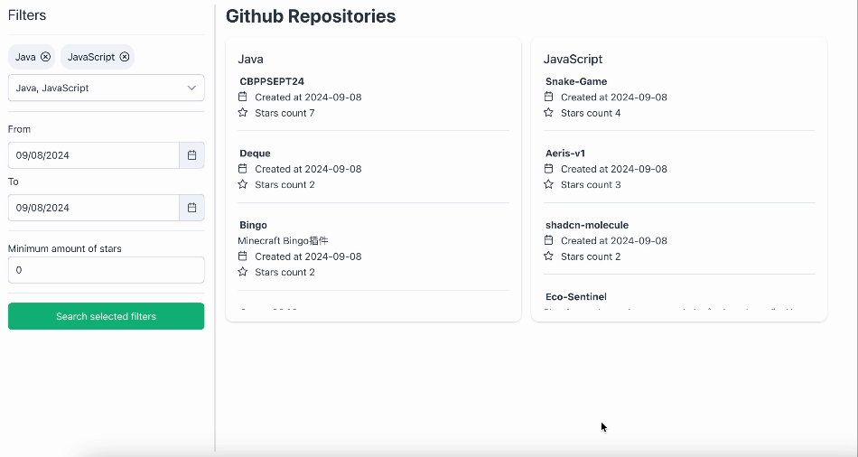

# Starred repos

Starred repos is a simple to use app for you to search the starred repositories from your favorite languages.

## 🌟 Highlights

- Filter by date range
- Filter by the minimum amount of stars

## 🚀 Quick Start

Clone repo, open it in your favorite IDE and install dependencies using `npm install`.

Once you have the setup done, simply run:

`npx vite --port=4000`

Like this you can have a quick look at the current state of the Starred repos in your localhost.

## 🏗️ Open topics

- implementing infinite scroll / lazy loading: fetch repos data while scrolling, right now the API rate limit is reached very easy
- form validations (e.g at least one language selected, date from/to proper selection, min/max star values?)
- usability of the date picker is not ideal as defaulting from/to to today is not good, normally in this kind of search you want to search in a bit of a longer timeframe, what would be the ideal default setting? 6 months?
- use loading state for a spinner
- decide on the best date format
- encode the query in the fetch call
- proper responsiveness (mobile view has some points to be adjusted)
- language picker from static list? is there no where we can get a list of programming languages from?
- min star input is not well designed, think about alternatives
- unit tests & integration tests
